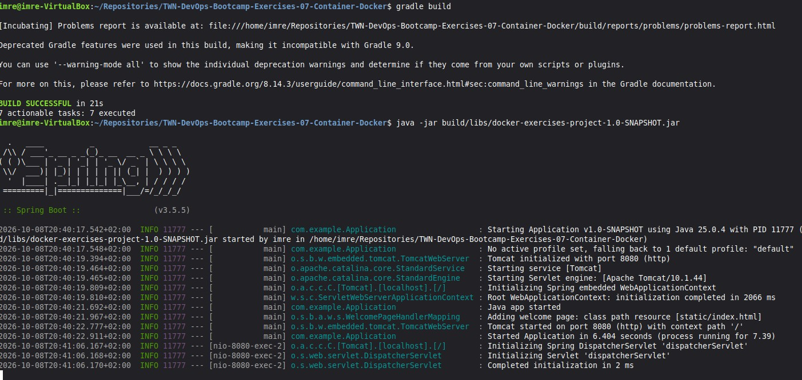
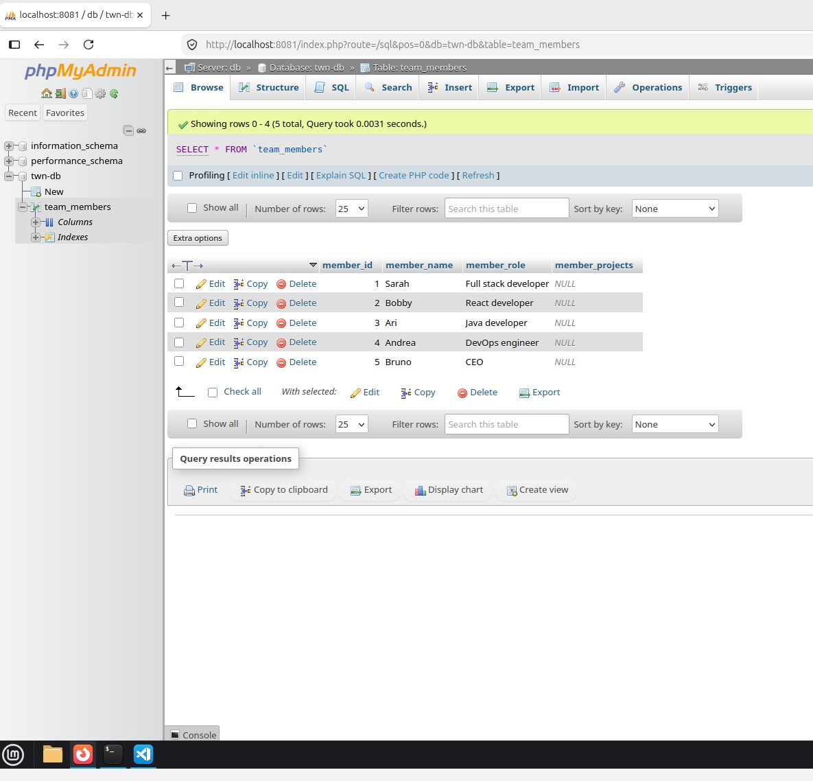

# Solutions for Exercises-07 Container-with-Docker

## Exercise 0

```bash
# Navigate to the working directory.
cd Repositories

# Cloning.
git clone https://gitlab.com/twn-devops-bootcamp/latest/07-docker/docker-exercises.git

# Deleting .git folder.
rm -rf docker-exercises/.git

# Renaming the folder, because I want to save it to my GitHub repository with a different name.
mv docker-exercises TWN-DevOps-Bootcamp-Exercises-07-Container-Docker
cd TWN-DevOps-Bootcamp-Exercises-07-Container-Docker

git init
git status

# Commit & push.
git add .
git commit -m "Initial commit"
git branch -M main
git remote add origin https://github.com/ImreBodnar/TWN-DevOps-Bootcamp-Exercises-07-Container-Docker.git
git push -u origin main
```

## Exercise 1

**At first let's install Docker:**

```bash
sudo apt update
sudo apt install docker.io

# I added myself to the docker group to avoid permission issues.
sudo usermod -aG docker MY_USER_NAME
# After this I had to restart my virtual machine.
```

**Let's start a MySQL container:**

```bash
docker run -p 3306:3306 \
--name twn-mysql \
-e MYSQL_ROOT_PASSWORD=1q2w3e4r \
-e MYSQL_DATABASE=twn-db \
-e MYSQL_USER=admin \
-e MYSQL_PASSWORD=q1w2e3r4 \
-d mysql:26.7
```

> I used intentionally a fixed version for MySQL instead of the latest tag.

**Export the neccessary environment variables, build and run the app:**

```bash
export DB_USER=admin
export DB_PWD=q1w2e3r4
export DB_SERVER=localhost
export DB_NAME=twn-db

cd ~/Repositories/TWN-DevOps-Bootcamp-Exercises-07-Container-Docker/
gradle build

java -jar build/libs/docker-exercises-project-1.0-SNAPSHOT.jar
```

**Result of build and run:**



## Exercise 2

**Let's run a PHPMyAdmin container:**

```bash
docker run -p 8081:80 \
--name twn-phpmyadmin \
--link twn-mysql:db \
-d phpmyadmin:5.2.3
```

> I used intentionally a fixed version for PHPMyAdmin instead of the latest tag.

**I successfully logged in to the PHPMyAdmin UI:**


